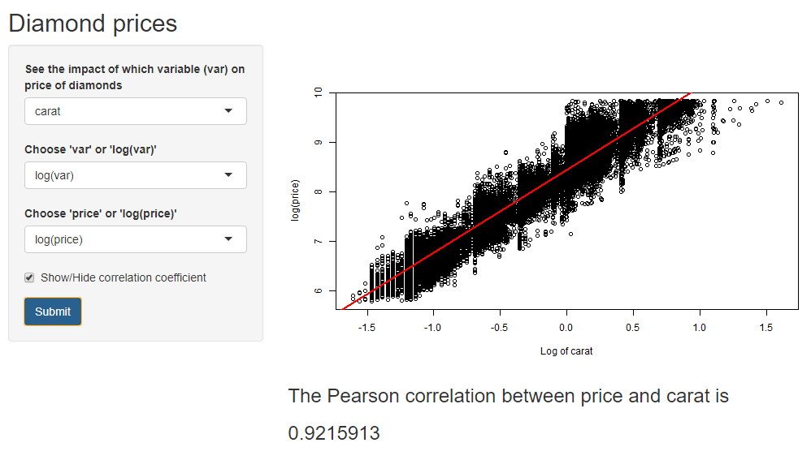
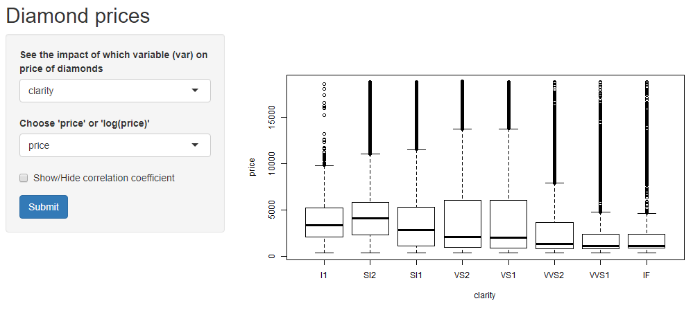

R presentation on Diamond Price app
========================================================
author: JayR
date: 29 June 2020
font-family: 'Cambria Math'
autosize: true

Data for the app
========================================================

The app is built for the `diamonds` dataset from the `ggplot2` package.

The diamonds data consists of prices (US dollars) for over 50,000 diamonds. It includes the following variables:
- **carat**: weight of the diamond
- **cut**: standard of the cut, i.e. Fair, Good, Very Good, Premium or Ideal
- **colour**: colour of the diamond ranging from D (best) to J (worst)
- **clarity**: how clear the diamond is
- **x, y and z**: the length, width and depth of the diamond in mm
- **depth**: the total depth percentage, i.e. *depth = z / mean(x,y)*
- **table**: the width of the top of the diamond relative to the widest point.

Snapshot of the app
========================================================

Features of the app
========================================================

The app does the following:
- Presents the relationship between diamond price and other variables as a **scatter plot** or **boxplot**.
- Plots a **linear regression line** on the graph (in red) for continuous variables.
- Calculates the **Pearson correlation coefficient** for continuous variables, e.g. the correlation between **price** and **carat** is **0.9215913**.
- Provides the option to consider log(price) and the **log** of other continuous variables.

App view for a categoric variable (i.e. colour, cut and clarity)
========================================================

**Notice how the log selection box has disappeared since the log of a categoric variable is undefined!**
