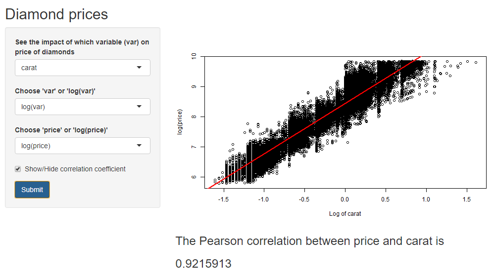

```{r setup, include=FALSE}
knitr::opts_chunk$set(echo = TRUE)
```

# Overview

This app creates scatter and box plots of variables from the `diamonds` dataset from `ggplot2`. The app considers the impact of various x variables on the price of a diamond. There is also the option to consider the log of price and the log of other continuous variables.

For continuous variables, the app will plot a linear regression line (in red) on the scatter plot. This is calculated using the `lm` function.

The app also calculates the Pearson correlation between the chosen variable and diamond price for continuous variables, which is displayed underneath the graph.

**Screenshot from the Diamond price app**


# Inputs

There are three main inputs:  
- **selected x variable (var)**: select the x variable to determine its impact on the diamond price  
- **price or log(price)**: whether to view the relationship between the x variables and the price or log(price)  
- **var or log(var)**: (for continuous variables only) select whether to compare the price to the x variable or the log of the x variable.

# Using the app

1) Select the above inputs from the selection boxes on the left.  
2) For continuous variables, decide if you want to view the Pearson correlation coefficient between diamond price and the chosen x variable. Click the checkbox accordingly.
3) Press the 'Submit' button to view a new selection.